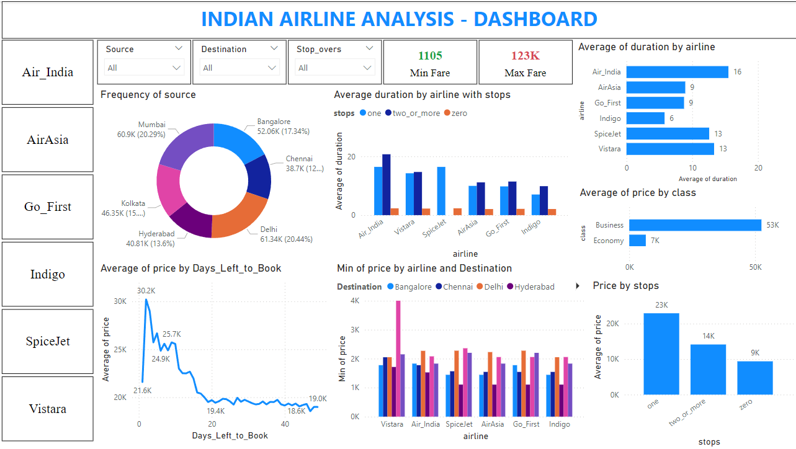

<html lang="en">
<head>
  <meta charset="UTF-8" />
  <meta name="viewport" content="width=device-width, initial-scale=1.0"/>
  <title>Power BI Sales Dashboard – Arunaachalam</title>

  <!-- Google Fonts -->
  <link href="https://fonts.googleapis.com/css2?family=Inter:wght@400;600;700&display=swap" rel="stylesheet">

  
</head>
<body>

  

    <h1>📊 Power BI Dashboard</h1>
    
Built using Power BI, Excel, and DAX /p>
  

  

    <h2>🔍 Project Overview</h2>
    
This dashboard visualizes monthly sales data, highlights top-performing products, and shows trends across regions.

    <h2>🖼️ Report Screenshots</h2>
    

    <h2>📥 Download</h2>
    

      🔗 <a href="Airline.pbix" download>Download Power BI (.pbix) File</a>
    

    <footer>
      
Made with 💙 by <strong>Arunaachalam</strong>

    </footer>
  

</body>
</html>
